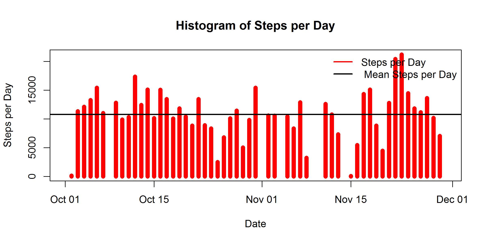
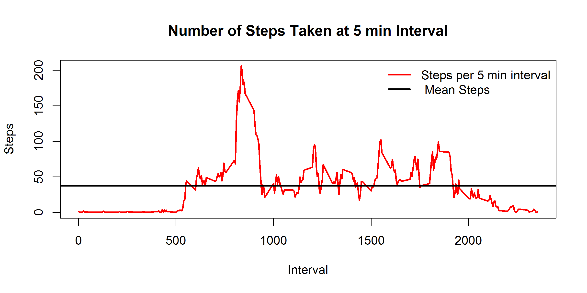
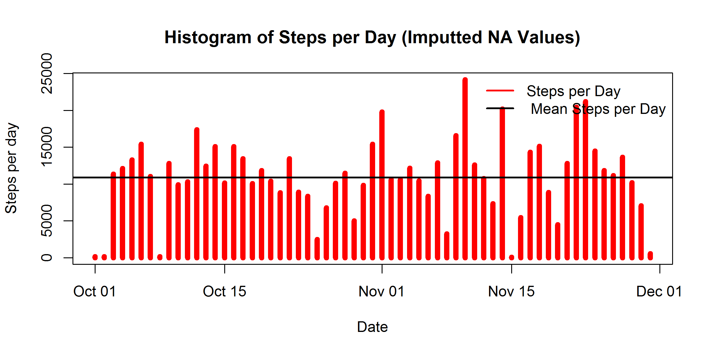
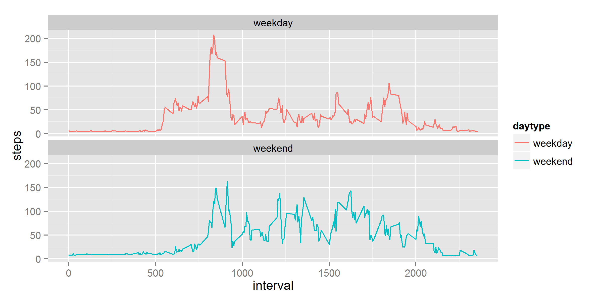

# Introduction

It is now possible to collect a large amount of data about personal movement using activity monitoring devices such as a Fitbit, Nike Fuelband, or Jawbone Up. These type of devices are part of the "quantified self" movement - a group of enthusiasts who take measurements about themselves regularly to improve their health, to find patterns in their behavior, or because they are tech geeks. But these data remain under-utilized both because the raw data are hard to obtain and there is a lack of statistical methods and software for processing and interpreting the data.

This assignment makes use of data from a personal activity monitoring device. This device collects data at 5 minute intervals through out the day. The data consists of two months of data from an anonymous individual collected during the months of October and November, 2012 and include the number of steps taken in 5 minute intervals each day.

# Data

The data for this assignment can be downloaded from the course web site:

Dataset: [Activity monitoring data](https://d396qusza40orc.cloudfront.net/repdata%2Fdata%2Factivity.zip)
The variables included in this dataset are:

steps: Number of steps taking in a 5-minute interval (missing values are coded as NA)

date: The date on which the measurement was taken in YYYY-MM-DD format

interval: Identifier for the 5-minute interval in which measurement was taken

The dataset is stored in a comma-separated-value (CSV) file and there are a total of 17,568 observations in this dataset.

# Loading and preprocessing the data


```r
# Read data
data <- read.csv(file="~/R/reprod_research_coursera/project1/activity.csv")

#structure of data
str(data)
```

```
## 'data.frame':	17568 obs. of  3 variables:
##  $ steps   : int  NA NA NA NA NA NA NA NA NA NA ...
##  $ date    : Factor w/ 61 levels "2012-10-01","2012-10-02",..: 1 1 1 1 1 1 1 1 1 1 ...
##  $ interval: int  0 5 10 15 20 25 30 35 40 45 ...
```

```r
# Convert date variable from factor to date
data$date <- as.Date(data$date)

# Melt data to cast by date
data.melt.date <- melt(data, id.vars="date", measure.vars="steps", na.rm=FALSE)

# Cast data to see steps per day - sums the steps by date 
data.cast.date <- dcast(data.melt.date, date ~ variable, sum)
```

# What is mean total number of steps taken per day?


```r
#plot data
plot(data.cast.date$date, data.cast.date$steps, type="h", main="Histogram of Steps per Day", xlab="Date", ylab="Steps per Day", col="red", lwd=7)
abline(h=mean(data.cast.date$steps, na.rm=TRUE), col="black", lwd=2)
legend("topright", c("Steps per Day", " Mean Steps per Day"), col=c("red", "black"), lwd=2, bty="n")
```

 

```r
# Mean and median of daily steps
paste("Mean Steps per Day =", mean(data.cast.date$steps, na.rm=TRUE))
```

```
## [1] "Mean Steps per Day = 10766.1886792453"
```

```r
paste("Median Steps per Day =", median(data.cast.date$steps, na.rm=TRUE))
```

```
## [1] "Median Steps per Day = 10765"
```

# What is the average daily activity pattern?

The data is recasted to produce a plot based on interval instead of day.

```r
# Melt data to cast by date
data.melt.int <- melt(data, id.vars="interval", measure.vars="steps", na.rm=TRUE)

# Cast data to see steps per day - sums the steps by date 
data.cast.int <- dcast(data.melt.int, interval ~ variable, mean)

plot(data.cast.int$interval, data.cast.int$steps, type="l", main="Number of Steps Taken at 5 min Interval", xlab="Interval", ylab="Steps", col="red", lwd=2)
abline(h=mean(data.cast.int$steps, na.rm=TRUE), col="black", lwd=2)
legend("topright", c("Steps per 5 min interval", " Mean Steps"), col=c("red", "black"), lwd=2, bty="n")
```

 

```r
paste("The 5-minute interval, on average across all the days in the dataset that contains the maximum number of steps =", data.cast.int[which.max(data.cast.int$steps),])
```

```
## [1] "The 5-minute interval, on average across all the days in the dataset that contains the maximum number of steps = 835"             
## [2] "The 5-minute interval, on average across all the days in the dataset that contains the maximum number of steps = 206.169811320755"
```

# Imputing missing values


```r
# NA rows
sum(is.na(data$steps))
```

```
## [1] 2304
```

```r
# Strategy for filling in all of the missing values in the dataset

# 1. copying data to new variable
data.no.na <- data
# 2. Merge data with data casted with avg. of 5 min interval above
data.merge = merge(data.no.na, data.cast.int, by="interval", suffixes=c(".data", ".stepint"))  
head(data.merge)
```

```
##   interval steps.data       date steps.stepint
## 1        0         NA 2012-10-01           1.7
## 2        0          0 2012-11-23           1.7
## 3        0          0 2012-10-28           1.7
## 4        0          0 2012-11-06           1.7
## 5        0          0 2012-11-24           1.7
## 6        0          0 2012-11-15           1.7
```

```r
# 3. Replace NA values with value from steps.stepint
data.no.na[which(is.na(data.no.na$steps)),"steps"] = data.merge[which(is.na(data.no.na$steps)),"steps.stepint"]
head(data.no.na)
```

```
##   steps       date interval
## 1   1.7 2012-10-01        0
## 2   1.7 2012-10-01        5
## 3   1.7 2012-10-01       10
## 4   1.7 2012-10-01       15
## 5   1.7 2012-10-01       20
## 6   1.7 2012-10-01       25
```

```r
# check for NA values
sum(is.na(data.no.na$steps))
```

```
## [1] 0
```

```r
# histogram of the total number of steps taken each day
# Melt new data frame to prep for casting by date
data.no.na.melt <- melt(data.no.na, id.vars="date", measure.vars="steps", na.rm=FALSE)

# Cast data frame to see steps per day
data.no.na.cast <- dcast(data.no.na.melt, date ~ variable, sum)

# Plot histogram with frequency of steps by day
plot(data.no.na.cast$date, data.no.na.cast$steps, type="h", main="Histogram of Steps per Day (Imputted NA Values)", xlab="Date", ylab="Steps per day", col="red", lwd=6)
abline(h=mean(data.no.na.cast$steps), col="black", lwd=2)
legend("topright", c("Steps per Day", " Mean Steps per Day"), col=c("red", "black"), lwd=2, bty="n")
```

 

```r
# Mean and median of daily steps
paste("Mean Steps per Day =", mean(data.no.na.cast$steps, na.rm=TRUE))
```

```
## [1] "Mean Steps per Day = 10889.7992576554"
```

```r
paste("Median Steps per Day =", median(data.no.na.cast$steps, na.rm=TRUE))
```

```
## [1] "Median Steps per Day = 11015"
```

>  Impact of imputing missing data on the estimates of the total daily number of steps:

Original Data Set (with NA values) - 


Mean Steps per Day = 10766.1886792453 and

Median Steps per Day = 10765 


New Data Sets (NAs imputed with mean value for that interval) -


Mean Steps per Day = 10889.7992576554 and

Median Steps per Day = 11015


As seen above there is some difference in the mean and median of the two datasets.


# Differences in activity patterns between weekdays and weekends


```r
# For loop to identify weekday from weekend
for (i in 1:nrow(data.no.na)) {
    if (weekdays(data.no.na$date[i]) == "Saturday" | weekdays(data.no.na$date[i]) == "Sunday") {
        data.no.na$daytype[i] = "weekend"
    } else {
        data.no.na$daytype[i] = "weekday"
    }
}

# create new factor variable in the dataset with two levels - "weekday" and "weekend" indicating whether a given date is a weekday or weekend day.
    
data.no.na$daytype <- as.factor(data.no.na$daytype)

# panel plot containing a time series plot (i.e. type = "l") of the 5-minute interval (x-axis) and the average number of steps taken, averaged across all weekday days or weekend days (y-axis)

melted <- melt(data.no.na, id=c("interval", "daytype"), measure.vars="steps")
casted <- dcast(melted, interval + daytype ~ variable, mean)

p <- ggplot(casted, aes(x=interval, y=steps, color = daytype)) + 
    geom_line() + 
    facet_wrap(~ daytype, ncol=1,nrow=2)
print(p)
```

 

