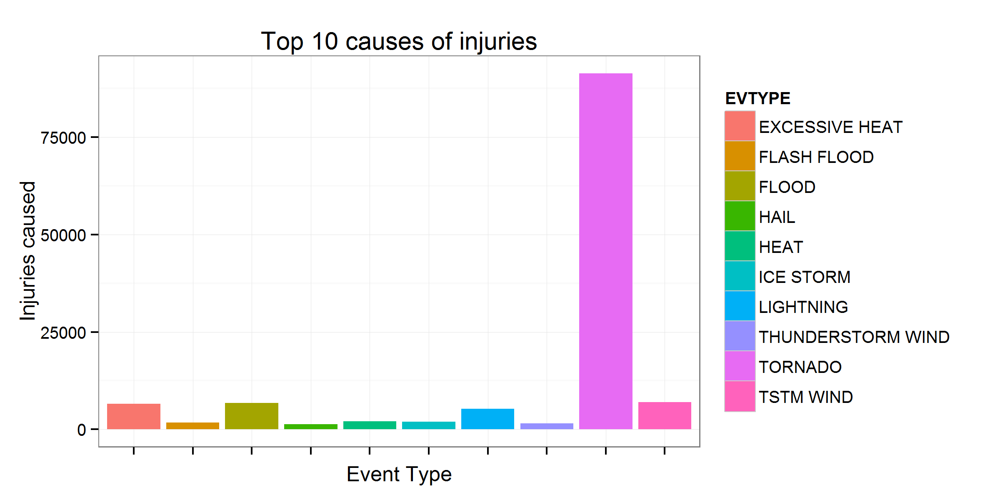
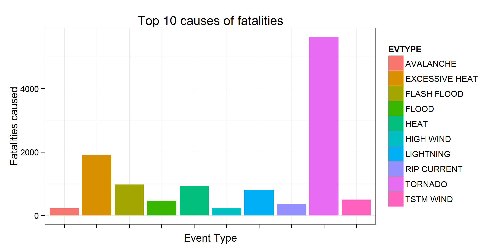
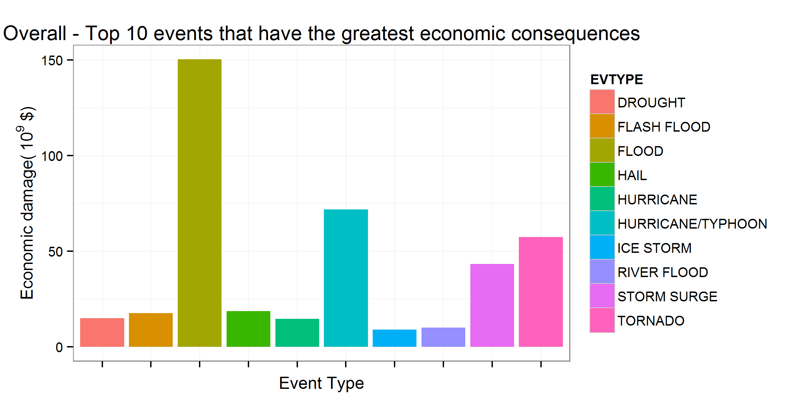

# Synopsis

Storms and other severe weather events can cause both public health and economic problems for communities and municipalities. Many severe events can result in fatalities, injuries, and property damage, and preventing such outcomes to the extent possible is a key concern.

This project involves exploring the U.S. National Oceanic and Atmospheric Administration's (NOAA) storm database. This database tracks characteristics of major storms and weather events in the United States, including when and where they occur, as well as estimates of any fatalities, injuries, and property damage.

In this report we will analyse the NOAA Storm Events data. The raw data start from year 1950 to November 2011, with 902297 records. The data is composed by 37 variables, 7 of which seemed relevent to the analysis. Data will be processed, re-orderd and analysed in order to find answers for the following:

+ Across the United States, which types of events are most harmful with respect to population health?


+ Across the United States, which types of events have the greatest economic consequences?
Data will rapresented in tabular and graphical means.


# Data

Dataset: [Storm Data](https://d396qusza40orc.cloudfront.net/repdata%2Fdata%2FStormData.csv.bz2)

There is also some documentation of the database available.

The events in the database start in the year 1950 and end in November 2011. In the earlier years of the database there are generally fewer events recorded, most likely due to a lack of good records. More recent years should be considered more complete.

# Loading and preprocessing the data


```r
# Read data
data <- read.csv(bzfile("repdata-data-StormData.csv.bz2"))

#structure of data
str(data)
```

```
## 'data.frame':	902297 obs. of  37 variables:
##  $ STATE__   : num  1 1 1 1 1 1 1 1 1 1 ...
##  $ BGN_DATE  : Factor w/ 16335 levels "1/1/1966 0:00:00",..: 6523 6523 4242 11116 2224 2224 2260 383 3980 3980 ...
##  $ BGN_TIME  : Factor w/ 3608 levels "00:00:00 AM",..: 272 287 2705 1683 2584 3186 242 1683 3186 3186 ...
##  $ TIME_ZONE : Factor w/ 22 levels "ADT","AKS","AST",..: 7 7 7 7 7 7 7 7 7 7 ...
##  $ COUNTY    : num  97 3 57 89 43 77 9 123 125 57 ...
##  $ COUNTYNAME: Factor w/ 29601 levels "","5NM E OF MACKINAC BRIDGE TO PRESQUE ISLE LT MI",..: 13513 1873 4598 10592 4372 10094 1973 23873 24418 4598 ...
##  $ STATE     : Factor w/ 72 levels "AK","AL","AM",..: 2 2 2 2 2 2 2 2 2 2 ...
##  $ EVTYPE    : Factor w/ 985 levels "   HIGH SURF ADVISORY",..: 834 834 834 834 834 834 834 834 834 834 ...
##  $ BGN_RANGE : num  0 0 0 0 0 0 0 0 0 0 ...
##  $ BGN_AZI   : Factor w/ 35 levels "","  N"," NW",..: 1 1 1 1 1 1 1 1 1 1 ...
##  $ BGN_LOCATI: Factor w/ 54429 levels "","- 1 N Albion",..: 1 1 1 1 1 1 1 1 1 1 ...
##  $ END_DATE  : Factor w/ 6663 levels "","1/1/1993 0:00:00",..: 1 1 1 1 1 1 1 1 1 1 ...
##  $ END_TIME  : Factor w/ 3647 levels ""," 0900CST",..: 1 1 1 1 1 1 1 1 1 1 ...
##  $ COUNTY_END: num  0 0 0 0 0 0 0 0 0 0 ...
##  $ COUNTYENDN: logi  NA NA NA NA NA NA ...
##  $ END_RANGE : num  0 0 0 0 0 0 0 0 0 0 ...
##  $ END_AZI   : Factor w/ 24 levels "","E","ENE","ESE",..: 1 1 1 1 1 1 1 1 1 1 ...
##  $ END_LOCATI: Factor w/ 34506 levels "","- .5 NNW",..: 1 1 1 1 1 1 1 1 1 1 ...
##  $ LENGTH    : num  14 2 0.1 0 0 1.5 1.5 0 3.3 2.3 ...
##  $ WIDTH     : num  100 150 123 100 150 177 33 33 100 100 ...
##  $ F         : int  3 2 2 2 2 2 2 1 3 3 ...
##  $ MAG       : num  0 0 0 0 0 0 0 0 0 0 ...
##  $ FATALITIES: num  0 0 0 0 0 0 0 0 1 0 ...
##  $ INJURIES  : num  15 0 2 2 2 6 1 0 14 0 ...
##  $ PROPDMG   : num  25 2.5 25 2.5 2.5 2.5 2.5 2.5 25 25 ...
##  $ PROPDMGEXP: Factor w/ 19 levels "","-","?","+",..: 17 17 17 17 17 17 17 17 17 17 ...
##  $ CROPDMG   : num  0 0 0 0 0 0 0 0 0 0 ...
##  $ CROPDMGEXP: Factor w/ 9 levels "","?","0","2",..: 1 1 1 1 1 1 1 1 1 1 ...
##  $ WFO       : Factor w/ 542 levels ""," CI","$AC",..: 1 1 1 1 1 1 1 1 1 1 ...
##  $ STATEOFFIC: Factor w/ 250 levels "","ALABAMA, Central",..: 1 1 1 1 1 1 1 1 1 1 ...
##  $ ZONENAMES : Factor w/ 25112 levels "","                                                                                                                               "| __truncated__,..: 1 1 1 1 1 1 1 1 1 1 ...
##  $ LATITUDE  : num  3040 3042 3340 3458 3412 ...
##  $ LONGITUDE : num  8812 8755 8742 8626 8642 ...
##  $ LATITUDE_E: num  3051 0 0 0 0 ...
##  $ LONGITUDE_: num  8806 0 0 0 0 ...
##  $ REMARKS   : Factor w/ 436781 levels "","-2 at Deer Park\n",..: 1 1 1 1 1 1 1 1 1 1 ...
##  $ REFNUM    : num  1 2 3 4 5 6 7 8 9 10 ...
```

```r
# subset event type from data
event.type <- c("EVTYPE", "FATALITIES", "INJURIES", "PROPDMG", "PROPDMGEXP", "CROPDMG", 
           "CROPDMGEXP")
data.event <- data[event.type]
```

# Across the United States, which types of events (as indicated in the EVTYPE variable) are most harmful with respect to population health?

## The events causing most injuries


```r
data.injuries <- aggregate(data.event$INJURIES, by = list(EVTYPE = data.event$EVTYPE), sum)
#head(data.injuries)
data.injuries <- data.injuries[order(data.injuries$x, decreasing = TRUE), ]

#plot
p1 <- ggplot(data.injuries[1:10, ], aes(factor(EVTYPE), y = x)) + 
    geom_bar(aes(fill=EVTYPE),stat = "identity") + 
    theme_bw() + 
    xlab("Event Type") +
    ylab("Injuries caused") + 
    ggtitle("Top 10 causes of injuries") +
    theme(axis.text.x = element_blank())
```

## The events causing most deaths


```r
data.death <- aggregate(data.event$FATALITIES, by = list(EVTYPE = data.event$EVTYPE), sum)
#head(data.death)
data.death <- data.death[order(data.death$x, decreasing = TRUE), ]

#plot
p2 <- ggplot(data.death[1:10, ], aes(factor(EVTYPE), y = x)) + 
    geom_bar(aes(fill=EVTYPE),stat = "identity") + 
    theme_bw() + 
    xlab("Event Type") +
    ylab("Fatalities caused") + 
    ggtitle("Top 10 causes of fatalities") +
    theme(axis.text.x = element_blank())
```

# Across the United States, which types of events have the greatest economic consequences?


```r
#Change PROPDMGEXP  magnitude to numeric representation
data.event$PROPDMGEXP <- as.character(data.event$PROPDMGEXP)
data.event$PROPDMGEXP <- gsub("\\-|\\+|\\?|0","1", data.event$PROPDMGEXP)
data.event$PROPDMGEXP <- gsub("h|H","100", data.event$PROPDMGEXP)
data.event$PROPDMGEXP <- gsub("k|K","1000", data.event$PROPDMGEXP)
data.event$PROPDMGEXP <- gsub("m|M","1000000", data.event$PROPDMGEXP)
data.event$PROPDMGEXP <- gsub("b|B","1000000000", data.event$PROPDMGEXP)
data.event$PROPDMGEXP <- as.numeric(data.event$PROPDMGEXP)
data.event$PROPDMGEXP[is.na(data.event$PROPDMGEXP)] <- 0

#Change CROPDMGEXP  magnitude to numeric representation 
data.event$CROPDMGEXP <- as.character(data.event$CROPDMGEXP)
data.event$CROPDMGEXP <- gsub("\\-|\\+|\\?|0","1", data.event$CROPDMGEXP)
data.event$CROPDMGEXP <- gsub("h|H","100", data.event$CROPDMGEXP)
data.event$CROPDMGEXP <- gsub("k|K","1000", data.event$CROPDMGEXP)
data.event$CROPDMGEXP <- gsub("m|M","1000000", data.event$CROPDMGEXP)
data.event$CROPDMGEXP <- gsub("b|B","1000000000", data.event$CROPDMGEXP)
data.event$CROPDMGEXP <- as.numeric(data.event$CROPDMGEXP)
data.event$CROPDMGEXP[is.na(data.event$CROPDMGEXP)] <- 0
```
## Overall Economic damage ($)


```r
econ <- group_by(data.event, EVTYPE) %>% 
    summarize(econ = sum(PROPDMG * PROPDMGEXP + CROPDMG * CROPDMGEXP)) %>% 
    top_n(10) 
```

```
## Selecting by econ
```

```r
econ <- econ[order(econ$econ, decreasing = TRUE), ]

head(econ)
```

```
## Source: local data frame [6 x 2]
## 
##               EVTYPE    econ
## 3              FLOOD 1.5e+11
## 6  HURRICANE/TYPHOON 7.2e+10
## 10           TORNADO 5.7e+10
## 9        STORM SURGE 4.3e+10
## 4               HAIL 1.9e+10
## 2        FLASH FLOOD 1.8e+10
```

```r
#plot
p3 <- ggplot(econ, aes(factor(EVTYPE), y = econ/10^9)) + 
    geom_bar(aes(fill=EVTYPE),stat = "identity") + 
    theme_bw() + 
    xlab("Event Type") +
    ylab(expression("Economic damage("~10^{9}~"$)")) + 
    ggtitle("Overall - Top 10 events that have the greatest economic consequences") +
    theme(axis.text.x = element_blank())
```
## Property damage ($)


```r
damage.prop <- aggregate(PROPDMG ~ EVTYPE, data = data.event, FUN = sum)
damage.prop <- damage.prop[order(damage.prop$PROPDMG, decreasing = TRUE), ]

p4 <- ggplot(damage.prop[1:10,],  
             aes(x=reorder(EVTYPE, PROPDMG), y=PROPDMG/10^6, fill=factor(EVTYPE))) + 
    geom_bar(aes(fill=EVTYPE),stat = "identity") + 
    theme_bw() + 
    xlab("Event Type") +
    ylab(expression("Economic damage("~10^{6}~"$)")) + 
    ggtitle("Top 10 events that have the greatest Property damage") +
    theme(axis.text.x = element_blank())
```

## Crop damage ($)


```r
damage.crop <- aggregate(CROPDMG ~ EVTYPE, data = data.event, FUN = sum)
damage.crop <- damage.crop[order(damage.crop$CROPDMG, decreasing = TRUE), ]

p5 <- ggplot(damage.crop[1:10,],  
             aes(x=reorder(EVTYPE, CROPDMG), y=CROPDMG/10^5, fill=factor(EVTYPE))) + 
    geom_bar(aes(fill=EVTYPE),stat = "identity") + 
    theme_bw() + 
    xlab("Event Type") +
    ylab(expression("Economic damage("~10^{5}~"$)")) + 
    ggtitle("Top 10 events that have the greatest Crop damage") +
    theme(axis.text.x = element_blank())
```

# Results

As shown in the figures below:

1. Tornados cause the most injuries.


2. Tornados cause the most fatalities.


3. Flooding causes the most economic damage($).


4. Tornado causes the most property damage($).


5. Hail causes the most crop damage($).


```r
print(p1)
```

 

```r
print(p2)
```

 

```r
print(p3) 
```

 

```r
#grid.arrange(p4, p5, nrow = 2) 
```
*It was not clear to me whether the greatest economic loss required is in terms of 
crop, property or overall. The report must have at most 3 plots. *Thus, I did create multiple figures but did not plot.*
